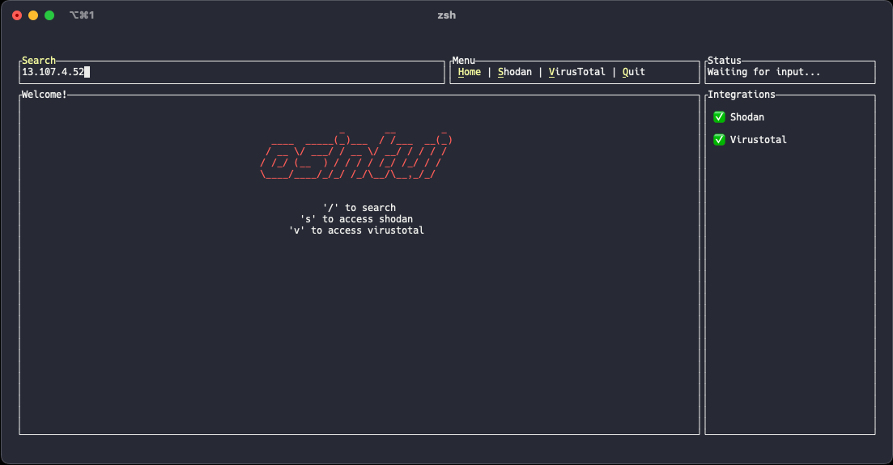

  
  <h1>osintui</h1>
  
 Open Source Intelligence Terminal User Interface 

  <!-- Badges -->
  

    
    
    
    
    
  

  <h4>
    <a href="https://github.com/wssheldon/osintui/issues/">Report Bug</a>
     · 
    <a href="https://github.com/wssheldon/osintui/issues/">Request Feature</a>
  </h4>

 

  

## Credits

⭐ **[spotify-tui](https://github.com/Rigellute/spotify-tui)**

The software architecture is almost entirely modelede after spotify-tui. The codebase was invaluable in learning how to cleanly manage complex TUI state and implement generic handling of TUI components.

⭐ [wtfis](https://github.com/pirxthepilot/wtfis)

I needed a good first project to leanr rust and wtfis was the primary source of inspiration for osintui.
